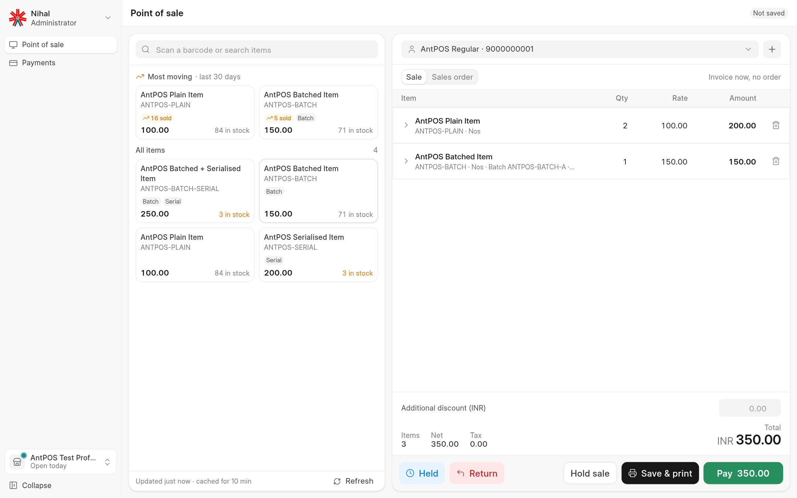
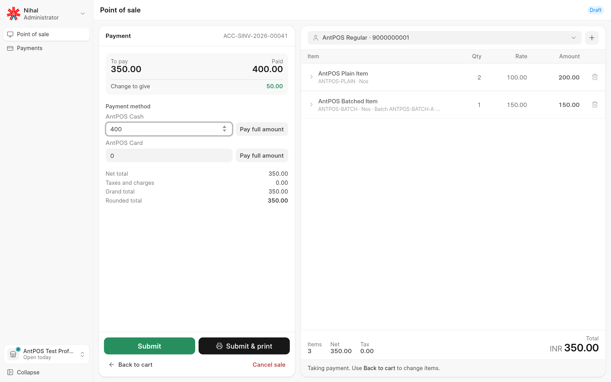
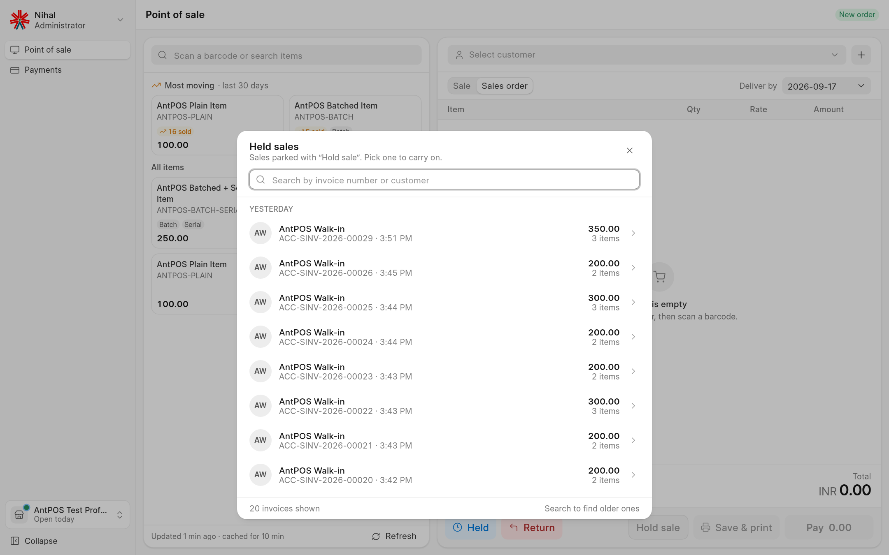
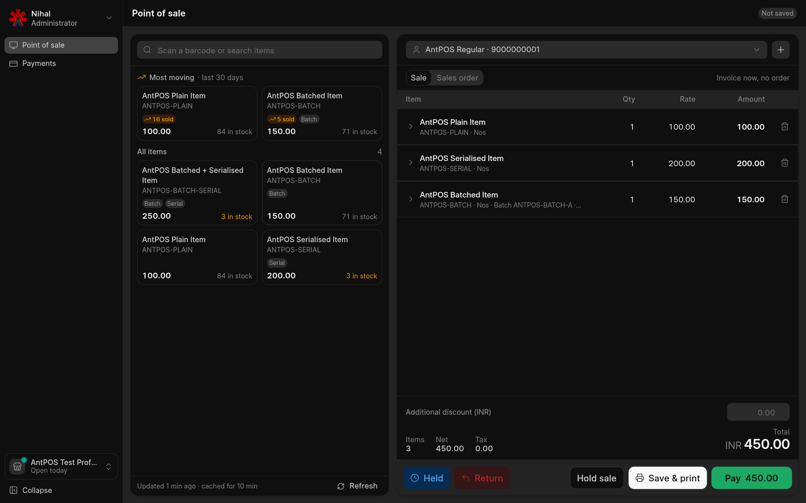
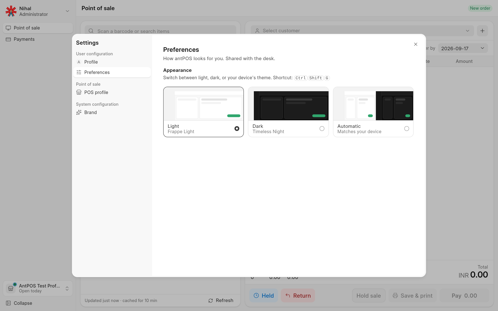
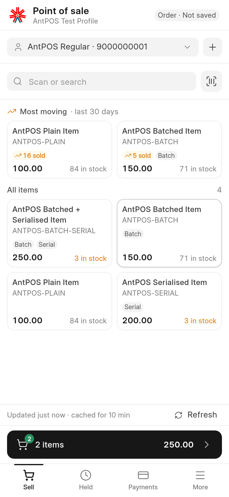
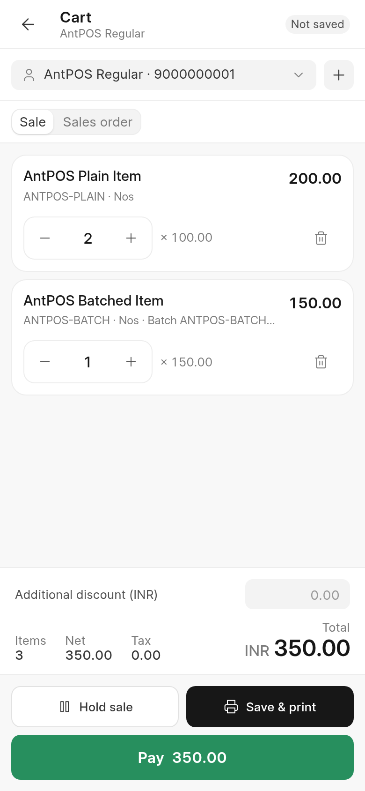
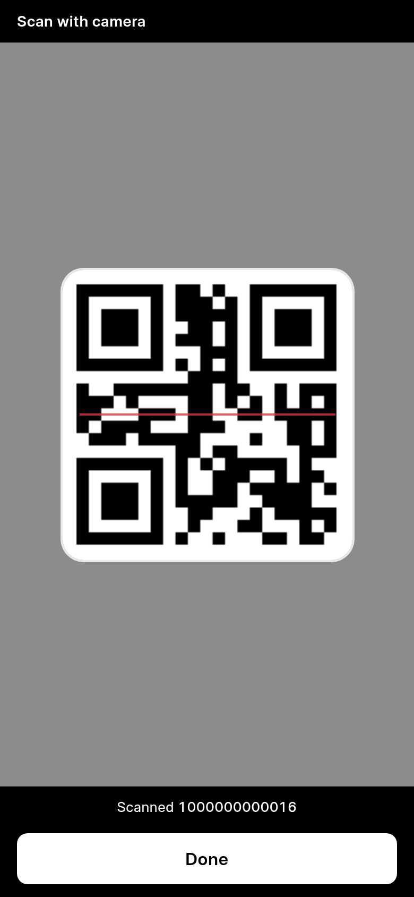

# antPOS

A point of sale app for **ERPNext**, built with Frappe UI. It works on desktop,
tablet and phone, and can be installed as an app from the browser.



## Features

- **Fast checkout:** scan barcodes, serial and batch numbers, or tap items from
  a list that shows the most moving items first.
- **Camera scanning:** scan barcodes and QR codes with the phone camera.
- **Payments:** split across payment methods, give change, sell on credit, and
  use customer advances.
- **Discounts and rates:** per line or for the whole sale, as the POS Profile
  allows.
- **Held sales and returns:** park a sale and pick it up later, or return items
  from a past invoice.
- **Sales orders:** create a Sales Order with the invoice when needed.
- **Shifts:** open and close cashier shifts with a cash count per payment
  method.
- **Standard ERPNext documents:** sales, returns and payments are normal Sales
  Invoices and Payment Entries.
- **Customisable forms:** admins can change the New customer form and the cart
  line details from the POS.
- **Themes:** light, dark and automatic.
- **Installable app (PWA)** for desktop, Android and iOS.

## Screenshots

| Payment | Held sales |
|---|---|
|  |  |

| Dark mode | Settings |
|---|---|
|  |  |

| Items | Cart | Camera scan |
|---|---|---|
|  |  |  |

## Requirements

- Frappe and ERPNext v15

## Installation

```bash
cd ~/frappe-bench
bench get-app ant_pos https://github.com/anthertech/antPOS.git
bench --site yoursite.com install-app ant_pos
bench --site yoursite.com migrate
bench build --app ant_pos
```

Open `https://yoursite.com/antPOS`.

## Setup

1. **Mode of Payment:** add an account for your company to each payment method
   you want to use.
2. **POS Profile:** set the company, warehouse, price list and payment methods,
   and add your cashiers under *Applicable for Users*.
3. **Users:** give cashiers the **POS Cash** role (sell and take payments) or
   **POS Billing** (prepare sales only).
4. Open `/antPOS`, start a shift, pick a customer and start selling.

The camera and the installable app need the site to be served over HTTPS.

## License

MIT
